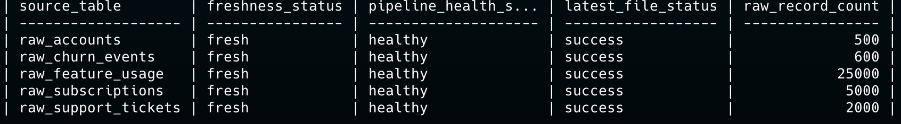
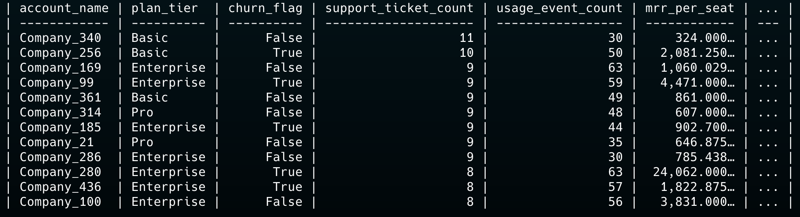
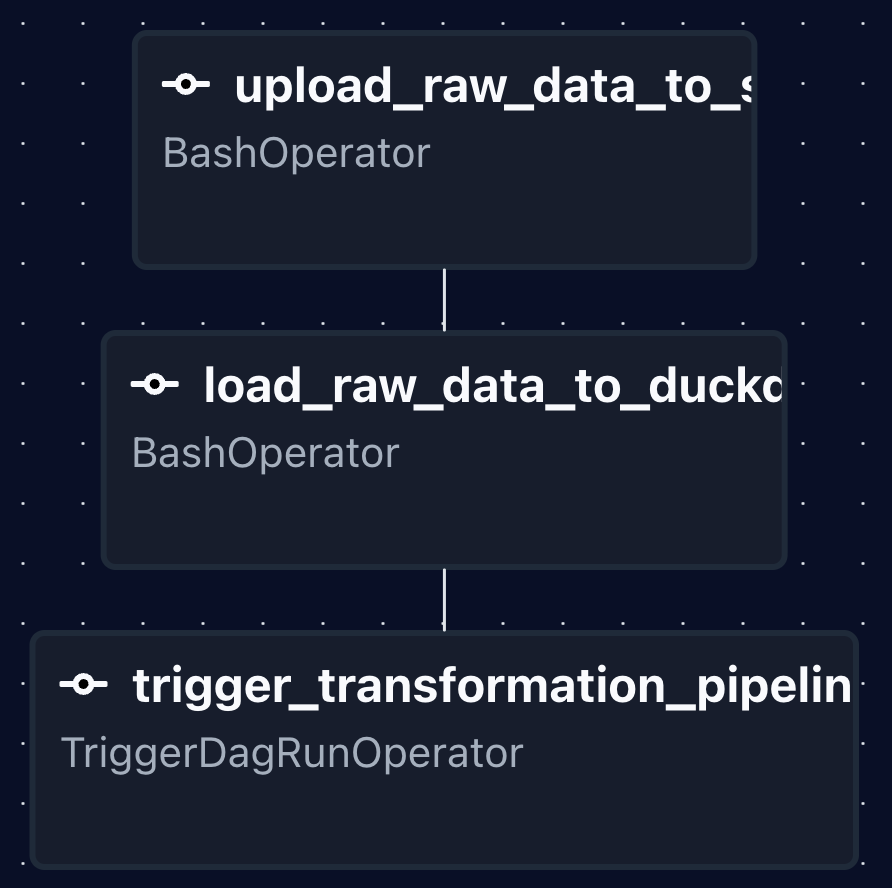
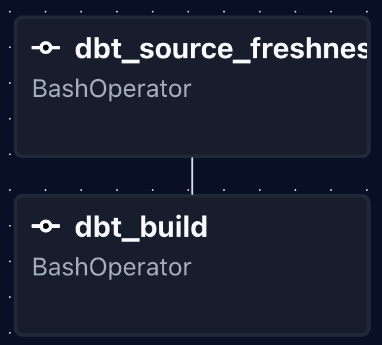
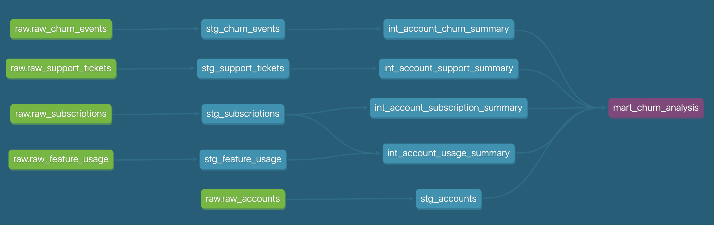

# SaaS Batch Analytics

[](https://github.com/jonas-schaetzle/saas-batch-analytics/actions/workflows/ci.yml)

End-to-end analytics engineering portfolio project for a synthetic SaaS business. The project ingests raw operational CSV data, records load metadata, builds a layered dbt model in DuckDB, validates data quality, and orchestrates the batch flow with Airflow.

The goal is not to mimic a large platform with unnecessary scaffolding. It is to show the judgment expected from an analytics engineer: clear model boundaries, reproducible execution, observable ingestion, testable transformations, and a credible path from local demo to production-grade architecture.

## What This Demonstrates

- Layered dbt modeling from `sources` to `staging`, `intermediate`, and `marts`
- SaaS-focused analytical outputs for churn, revenue, product usage, support, and pipeline health
- Idempotent raw loading into DuckDB using file checksums and ingestion audit tables
- Airflow orchestration with separated ingestion and transformation DAGs
- Source freshness checks, schema tests, SQL linting, Python linting, and CI validation
- Reviewer-friendly local workflow through Docker Compose and `make demo`

## Domain Scenario

The dataset represents a synthetic SaaS company with account, subscription, product usage, support, and churn activity. The analytical question is intentionally practical:

> Which customer, revenue, support, and product-usage signals help explain churn and pipeline health?

Raw data lives in `data/raw` and contains:

| Source | Rows | Purpose |
| --- | ---: | --- |
| `accounts.csv` | 500 | Customer attributes, signup context, plan, seats, churn flag |
| `subscriptions.csv` | 5,000 | Subscription periods, MRR/ARR, upgrades, downgrades, billing frequency |
| `feature_usage.csv` | 25,000 | Product usage events, feature breadth, duration, errors, beta usage |
| `support_tickets.csv` | 2,000 | Support volume, response time, resolution, satisfaction, escalations |
| `churn_events.csv` | 600 | Churn dates, reason codes, refund context |

Dataset credit: the raw synthetic RavenStack dataset was created by River @ Rivalytics and is documented in `data/raw/README.md`. It is used here for educational and portfolio purposes only.

## Architecture

```text
CSV raw files
   |
   | Python ingestion
   | - load metadata
   | - file checksum dedupe
   | - run/file audit tables
   v
DuckDB raw + ops tables
   |
   | dbt source freshness
   v
dbt staging models
   |
   v
dbt intermediate account summaries
   |
   v
dbt marts
   |-- mart_churn_analysis
   |-- mart_revenue_by_month
   |-- mart_pipeline_health
   |-- mart_ingestion_runs
   `-- mart_ingestion_file_loads
```

Airflow keeps ingestion and transformation responsibilities separate:

- `saas_ingestion_pipeline` uploads raw files to an S3-style landing path, loads DuckDB, records audit metadata, and triggers transformation.
- `saas_transformation_pipeline` validates source freshness and runs `dbt build`.

For local portfolio execution, DuckDB is the warehouse and the generated database file is kept under `dbt/saas_analytics/.local/`, outside version control.

## Screenshots

### Pipeline Health Mart

`mart_pipeline_health` condenses source freshness, latest file status, latest run status, and raw row counts into a small operational view.



### Churn Analysis Mart

`mart_churn_analysis` joins account, subscription, support, product usage, and churn signals at account grain.



### Airflow Ingestion DAG

The ingestion DAG owns landing and raw-load concerns, then triggers the transformation DAG after a successful load.



### Airflow Transformation DAG

The transformation DAG fails fast on stale sources before building and testing dbt models.



### dbt Lineage

The dbt graph shows the intended modeling path from raw sources through staging and intermediate summaries into marts.



## dbt Model Design

The dbt project is intentionally conventional:

- `staging`: typed, cleaned, source-aligned models such as `stg_accounts`, `stg_subscriptions`, and `stg_feature_usage`
- `intermediate`: reusable account-level summaries for subscriptions, support, usage, and churn
- `marts`: business-facing and operational outputs

Key marts:

| Model | Grain | Why it exists |
| --- | --- | --- |
| `mart_churn_analysis` | One row per account | Combines commercial, support, usage, and churn context for churn analysis |
| `mart_revenue_by_month` | Month, plan tier, billing frequency | Tracks MRR/ARR and customer mix over time |
| `mart_pipeline_health` | One row per raw source | Provides a compact operational status view |
| `mart_ingestion_runs` | One row per ingestion run | Tracks run duration, loaded/skipped/failed files, and row totals |
| `mart_ingestion_file_loads` | One row per file event | Exposes checksums, file status, row counts, and timing |

Example derived churn features include `mrr_per_seat`, `support_tickets_per_subscription`, `usage_intensity_per_day`, `error_rate_per_usage`, `days_from_last_usage_to_churn`, and `beta_feature_adopter_flag`.

## Data Quality

The project uses dbt tests where they protect meaningful assumptions:

- primary key uniqueness and non-null constraints
- relationships between accounts, subscriptions, usage, support, and churn events
- accepted values for categorical fields such as `plan_tier`, `billing_frequency`, `priority`, and `referral_source`
- freshness thresholds on raw sources using ingestion-created `loaded_at`
- mart-level grain checks and business-rule assertions

The CI workflow mirrors the same intent: install dependencies, run Ruff, compile Airflow DAGs, lint dbt SQL, load raw data into DuckDB, validate source freshness, and run `dbt build`.

## Quickstart

Prerequisites:

- Docker
- Docker Compose
- `make`

Run the full local demo:

```bash
cp .env.example .env
make demo
```

The demo flow builds the dbt image, installs dbt packages, resets local DuckDB state, loads the raw CSV files, checks source freshness, runs lint/build validation, and prints a preview of `mart_pipeline_health`.

Useful follow-up commands:

```bash
make demo-preview
make source-freshness
make ci-local
make dbt-docs
```

The dbt profile includes two local targets:

- `dev`: builds into the `main` schema for local development
- `prod`: builds into the `prod` schema as a lightweight production-style target

## Reviewer Path

For a quick technical review:

1. Run `make demo`.
2. Inspect `mart_pipeline_health` for operational state.
3. Inspect `mart_churn_analysis` for business-facing modeling.
4. Open the two Airflow DAGs to review orchestration boundaries.
5. Generate dbt docs with `make dbt-docs` and inspect lineage plus model tests.

High-signal files:

- `airflow/dags/saas_ingestion_pipeline.py`
- `airflow/dags/saas_transformation_pipeline.py`
- `ingestion/scripts/load_raw_data_to_duckdb.py`
- `dbt/saas_analytics/models/marts/mart_churn_analysis.sql`
- `dbt/saas_analytics/models/marts/mart_pipeline_health.sql`
- `.github/workflows/ci.yml`

## Repository Structure

```text
.
|-- airflow/
|   `-- dags/
|-- data/
|   `-- raw/
|-- dbt/
|   `-- saas_analytics/
|       `-- models/
|           |-- staging/
|           |-- intermediate/
|           `-- marts/
|-- docs/
|   `-- screenshots/
|-- ingestion/
|   `-- scripts/
|-- terraform/
|   `-- dev/
|-- docker-compose.yml
|-- Dockerfile.airflow
|-- Dockerfile.dbt
|-- Makefile
`-- pyproject.toml
```

## Trade-offs

This is a portfolio project, so the implementation favors clarity and reproducibility over platform sprawl:

- DuckDB keeps the warehouse fast and local, but is not a substitute for a shared production warehouse.
- `prod` is represented as a separate DuckDB schema, not separate infrastructure.
- The S3 landing step demonstrates object-storage boundaries, while the local demo still loads from the checked-in raw dataset.
- Churn indicators are explainable analytical features, not a predictive ML model.
- Operational monitoring is kept in SQL marts instead of a separate observability stack.

## Production Path

The project is structured so the local pieces have obvious production equivalents:

| Local portfolio component | Production equivalent |
| --- | --- |
| DuckDB | Snowflake, BigQuery, Redshift, or Databricks SQL |
| Local raw CSV files | Object storage landing zone with partitioned raw files |
| Docker Compose Airflow | Managed Airflow or another production orchestrator |
| Local `.env` | Managed secrets and environment-specific configuration |
| GitHub Actions validation | CI plus deployment promotion across dev/stage/prod |
| Local dbt docs | Published docs and lineage on every validated release |

Next high-value extensions would be point-in-time churn modeling, stronger environment promotion, warehouse-native loading from landed objects, and alerting around freshness drift, failed runs, and volume anomalies.

## Notes

All data is fully synthetic. No real customer data or personally identifiable information is included.
